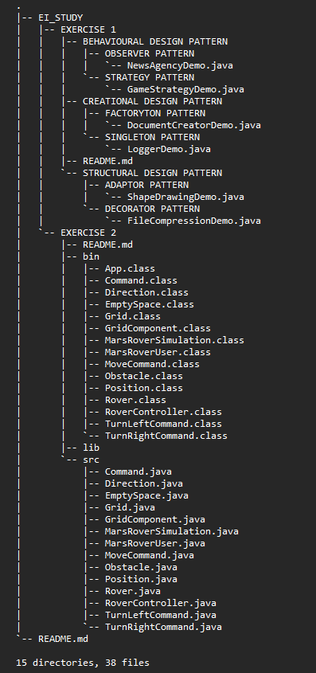

# EI STUDY ASSIGNMENT

This repository comprises of Exercise 1 and Exercise 2 code files and separate readme files for the illustration and explanation of the same. 

### Directory hierarchy : 

In Exercise 1 folder, all the code files are categorized and can be accessed easily. 

In Exercise 2 folder, all the code files are available in `/src` folder.

Clone this repository and try executing the code !!